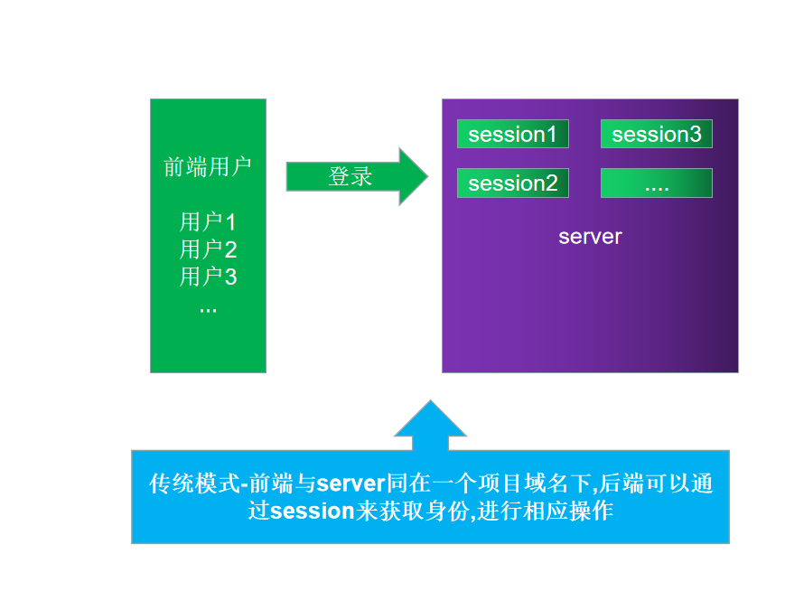

# 黑马头条PC第2天

## 反馈


## 黑马头条PC-初始化项目-git管理

- **`目标-任务`**在github建立一个远程仓库,并将新建的代码推到远程仓库上
- - 真正的项目开发都是采用git管理的  
  - 以后每天的模块增加 修改 删除 都会以git提交的方式 推送给同学们

1. 新建git远程仓库 

- 首先需要有一个github的账号 然后登陆github官网 进行新建远程仓库操作

2. 完成初始提交

```bash
$ git remote add origin 远程仓库地址
$ git push -u origin master  // -u 的意思是 记录当前的推送信息
```

之后开发的过程如果需要提交历史记录：

```bash
$ git add .  
$ git commit -m "log日志"
```

推送的时候如果不改变远程仓库和分支的话就直接：

```bash
$ git push 
```

## 黑马头条PC-初始化项目-安装ElementUI

- **`目标-任务`**在新建的项目中 安装elementUI 并提交git

- 安装

  - ```bash
    $ npm install element-ui --save
    ```

  - 在main.js文件中引入elementui模块和注册

    ```js
    
    import Vue from 'vue'
import App from './App.vue'
    import router from './router'
    import ElementUI from 'element-ui'  // 引入UI
    import 'element-ui/lib/theme-chalk/index.css' // 引入样式
    Vue.config.productionTip = false
    Vue.use(ElementUI)
    new Vue({
    router,
    render: h => h(App)
    }).$mount('#app')
    ```
    


## 黑马头条PC-初始化项目-整理目录-准备资源

- **`目标-任务`** 清理项目中无用的文件,并导入图片资源 到assets目录下  初始化引入一个index.css文件 
- 1. 清理无用的*.vue文件 
- 2. 导入准备好的图片资源
- 3. 在main.js中引入 一个index.less此样式文件的意义时  对于全局样式的设置 例如 margin padding的初始化配置
- 4. 提交git

结论: 此步骤的目的是准备好 开发资源 下一步做好准备

## 黑马头条PC-初始化项目-页面分析-新建登录和主页

- **`目标-任务`** 对具体的页面模块路由进行分析,并在路由中加入新建登录页面 
- 我们访问第一次会进入登录页面  得出 **`登录页`**是**`整个项目的入口页面`**, 登录页肯定属于一级路由
- 
- 进入主页后 我们发现 页面出现了**`三个区域`**  其中中间区域的内容切换菜单时 会发生变化,所以判断 主页存在**`二级路由`**


**`结论`**:通过以上得出结论,  **`登录页`** 和 **`主页`**都为一级路由,主页下 存在**`二级路由`**

根据一级路由和二级路由关系设计以下路由表

| path           | 功能     | 备注     |
| -------------- | -------- | -------- |
| /login         | 登录     | 一级路由 |
| /home          | 首页     | 一级路由 |
| /home/publish  | 发布文章 | 二级路由 |
| /home/articles | 文章列表 | 二级路由 |
| /home/comment  | 评论     | 二级路由 |
| /home/material | 素材     | 二级路由 |
| //home/fans    | 粉丝     | 二级路由 |
| /home/account  | 个人设置 | 二级路由 |

- 新建一个login组件和home组件,并配置路由表,在页面显示,提交git

## 黑马头条PC-登录模块-页面布局及样式

- **`目标-任务`**完成登录页的布局及开发
- 
- **`注意`**千人千面,每个前端程序员对于样式的实现方式都不一样,手法和手段各有不同,但是目标都是写出精美的页面. 
  - 既然我们选择使用elementUI框架,那么任何样式布局的东西都可以先在element中寻找是否有适合的
- 登录实际上个表单 我们可以在ElementUI提供的表单类组件中寻找可使用的组件

**`补充知识点`** 

在单文件组件中,如果需要在style标签中使用诸如 **less** **scss**  需要在style标签上 给lang属性赋值 如图


**scoped属性**

默认情况下，vue单文件组件的style样式是[全局的]()，

如果在一个应用中使用了**多个**单文件组件，它们使用<span style="background-color:yellow;">相同选择器</span>为相同的元素设置了style样式，那么只有一个会起作用(**后者会覆盖前者**)

**解决方法**：

如果加了**`scoped`**属性,那么当前组件的样式 **`只对当前自己的html`**起作用

给每个style标签都设置一个`scoped`属性，这样各个单文件组件的html标签解析出来后都会带有一个与其他单组件标签不同的`data-v-xxx`的唯一属性，style样式设定也会自动与本身组件的`data-v-xxx`联系起来，这样就使得style样式只针对自己的组件起作用了


登录页实际采用组件

* **`el-form`**是表单的容器 ,如果要放置表单, 需要放置在**`el-form`**里面
* 如果 要放置一个input组件到表单 =>  需要放置在**`el-form-item`**里面

- [el-card](https://element.eleme.cn/#/zh-CN/component/card)
- [el-form](https://element.eleme.cn/#/zh-CN/component/form)
- [el-form-item](https://element.eleme.cn/#/zh-CN/component/form)
- 页面内容

```xml
<div class="login">
    <el-card class="box-card">
      
      <el-form >
        <el-form-item prop="mobile">
          <el-input  placeholder="请输入手机号"></el-input>
        </el-form-item>
        <el-form-item prop="code">
          <el-input  placeholder="请输入验证码" style="width:240px"></el-input>
          <el-button style="float:right">发送验证码</el-button>
        </el-form-item>
        <el-form-item>
          <el-checkbox :checked="true">我已阅读并同意用户协议和隐私条款</el-checkbox>
        </el-form-item>
        <el-form-item>
          <el-button  type="primary" style="width:100%">登录</el-button>
        </el-form-item>
      </el-form>
    </el-card>
  </div>
```

页面样式

```less
.login {
  background-image: url("../../assets/login_bg.jpg");
  width: 100%;
  height: 100vh;
  background-size: cover;
  display: flex;
  justify-content: center;
  align-items: center;
  .box-card {
    width: 400px;
    height: 330px;
    img {
      display: block;
      width: 200px;
      margin: 10px auto;
    }
  }
}
```

最终实现效果


## 黑马头条PC-登录模块-数据绑定及校验

**`目标-任务`**完成登录模块的表单数据绑定及数据校验-实现点击登录对手机号和验证码的验证

* 通过采用elementUI的组件进行页面的渲染 绑定数据同样需要根据elementUI要求
* Form 组件提供了表单验证的功能，只需要通过 `rules` 属性传入约定的验证规则，并将 Form-Item 的 `prop` 属性设置为需校验的字段名即可。校验规则参见 [async-validator](https://github.com/yiminghe/async-validator)
* **el-form** 中的 **model**属性绑定表单数据对象
* **el-form** 中的 **rules**属性绑定数据的校验规则

| 规则      | 说明                                                         |
| --------- | ------------------------------------------------------------ |
| type      | 指定要检验的字段的类型                                       |
| required  | 必填项,如果不填 就无法通过校验                               |
| validator | 自定义校验函数                                               |
| message   | 当不满足设置的规则时的提示信息                               |
| pattern   | 正则表达式                                                   |
| range     | 使用min和max属性定义范围。对于字符串和数组类型，将根据长度进行比较，对于数字类型，数字不得小于min，也不得大于max。 |
| len       | 要验证字段的确切长度，请指定len属性。对于字符串和数组类型，对length属性执行比较，对于数字类型，此属性指示数字的完全匹配，即，它可能仅严格等于len。如果len属性与最小和最大范围属性组合，则len优先。 |
| enum      | 要从可能值列表中验证值，请使用带枚举属性的枚举类型，列出该字段的有效值，例如： var descriptor = {   role: {type: "enum", enum: ['admin', 'user', 'guest']} } |

如果数据校验不满足 还可以自定义校验函数 **`validator`**

**`validator`**是一个函数, 其中有三个参数 (**`rule`**(当前规则),`value`(当前值),**`callback`**(回调函数))

```js
var  func = function (rule, value, callback) {
    // 根据value进行进行校验 
    // 如果一切ok  
    // 直接执行callback
    callback()
    // 如果不ok 
    callback(new Error("错误信息"))
}
```


最终模板代码

```xml
 <div class="login">
    <el-card class="box-card">
      
      <el-form ref="form" :model="formData" :rules="rules" :status-icon="true">
        <el-form-item prop="mobile">
          <el-input v-model="formData.mobile" placeholder="请输入手机号"></el-input>
        </el-form-item>
        <el-form-item prop="code">
          <el-input v-model="formData.code" placeholder="请输入验证码" style="width:240px"></el-input>
          <el-button style="float:right">发送验证码</el-button>
        </el-form-item>
        <el-form-item>
          <el-checkbox :checked="true">我已阅读并同意用户协议和隐私条款</el-checkbox>
        </el-form-item>
        <el-form-item>
          <el-button @click="login" type="primary" style="width:100%">登录</el-button>
        </el-form-item>
      </el-form>
    </el-card>
  </div>
```

最终js代码

```js
methods: {
    login () {
      // 登录方法
      // 要进行手机号和验证码的校验
      this.$refs.form.validate(isOk => {
        if (isOk) {
          // 如果一切校验通过 需要调用登录接口
          this.loginByUsername()
        }
      })
    },
    // 根据用户名及验证码登录
    // 如果数据不能清空
    loginByUsername () {
    
    }
  },
  data () {

    return {
      // 定义数据
      formData: {
        mobile: '',
        code: ''
      },
      //  定义数据规则 给elementUI的表单使用
      rules: {
        mobile: [
          {
            required: true,
            message: '手机号不能为空',
            trigger: 'blur'
          },
          {
            len: 11,
            message: '手机长度必须为11个字符',
            trigger: 'blur'
          },
           {
            pattern: /^1[3456789]\d{9}$/,
            message: '手机号格式错误',
            trigger: 'blur'
          }
        ],
        code: [
          {
            required: true,
            message: '验证码不能为空'
          },
          {
            pattern:/^\d{6}$/,
            message: '验证码长度必须为6个数字',
            trigger: 'blur'
          }
        ]
      }
    }
  }
}
```

结论: 用到的**正则表达式**

手机号: **/^1[3456789]\d{9}$/**

6位数字:**/^\d{6}$/**

## 黑马头条PC-登录模块-安装axios-配置全局使用

**`目标-任务`** 将axios安装在当前项目中,并将其赋值给全局对象,在任何位置都可以访问 并配置baseUrl

* 登录需要接口访问,访问工具推荐 axios

* axios 安装到运行依赖

  ```bash 
  $ npm i axios -S
  or 
  $ npm install axios --save
  ```

* 引入axios 配置baseUrl

* 在main.js中引用 并赋值给Vue的原型属性

* 

## 黑马头条PC-登录模块-登录请求-返回值中token解析

**`目标-任务`** 通过axios调用登录接口,得到登录返回值 分析返回值意义

```js
     this.$http
        .post('/authorizations', this.formData)
        .then(result => {
            console.log(result)
        })
```

**得到的数据结果**:

<table>
  <thead class="ant-table-thead">
    <tr>
      <th key=name>名称</th><th key=type>类型</th><th key=required>是否必须</th><th key=default>默认值</th><th key=desc>备注</th><th key=sub>其他信息</th>
    </tr>
  </thead><tbody className="ant-table-tbody"><tr key=0-0><td key=0><span style="padding-left: 0px"><span style="color: #8c8a8a"></span> message</span></td><td key=1><span>string</span></td><td key=2>必须</td><td key=3></td><td key=4><span>消息提示</span></td><td key=5></td></tr><tr key=0-1><td key=0><span style="padding-left: 0px"><span style="color: #8c8a8a"></span> data</span></td><td key=1><span>object</span></td><td key=2>非必须</td><td key=3></td><td key=4><span>数据</span></td><td key=5></td></tr><tr key=0-1-0><td key=0><span style="padding-left: 20px"><span style="color: #8c8a8a">├─</span> token</span></td><td key=1><span>string</span></td><td key=2>必须</td><td key=3></td><td key=4><span>用户token令牌</span></td><td key=5></td></tr><tr key=0-1-1><td key=0><span style="padding-left: 20px"><span style="color: #8c8a8a">├─</span> refresh_token</span></td><td key=1><span>string</span></td><td key=2>必须</td><td key=3></td><td key=4><span>用于刷新token的令牌</span></td><td key=5></td></tr><tr key=0-1-2><td key=0><span style="padding-left: 20px"><span style="color: #8c8a8a">├─</span> id</span></td><td key=1><span>integer</span></td><td key=2>必须</td><td key=3></td><td key=4><span>用户id</span></td><td key=5></td></tr><tr key=0-1-3><td key=0><span style="padding-left: 20px"><span style="color: #8c8a8a">├─</span> name</span></td><td key=1><span>string</span></td><td key=2>必须</td><td key=3></td><td key=4><span>用户昵称</span></td><td key=5></td></tr><tr key=0-1-4><td key=0><span style="padding-left: 20px"><span style="color: #8c8a8a">├─</span> photo</span></td><td key=1><span>string</span></td><td key=2>必须</td><td key=3></td><td key=4><span>用户头像</span></td><td key=5></td></tr>
               </tbody>
              </table>

我们需要重点分析一下上面传给我们的**token(令牌)**

* **token令牌** 是**`前后分离`**时代的产物
* 传统模式 采用的是**session**和**cookie** 
* 


## 黑马头条PC-登录模块-登录请求-token存储问题

**`目标-任务`**对token令牌进行前端存储,以便后续接口访问使用

* 上个小节中我们发现 token会被频繁用到,不可能每次请求接口之前先去后端登录获取一下token,所以token要在前端进行持久化

**`前端持久化`** 可以直接采用 **`localStorage`** localStorage和session没关系

**注意**设置数据时,由于我们设置的用户信息是个对象 需要先将对象转化成字符串  

```js
JSON.stringify(obj)
```

实际代码

```js
 this.$http.post('/authorizations', this.formData).then(result => {
      window.localStorage.setItem('user-info',JSON.stringify(result.data.data))
 })
```

## 黑马头条PC-登录模块-登录成功及失败处理

**`目标-任务`** 对登录成功或者失败时进行不同的处理

* 登录成功时 需要跳转 到主页
* 登录失败时 提示信息

实际代码

```js
 this.$http.post('/authorizations', this.formData).then(result => {
            window.localStorage.setItem('user-info',JSON.stringify(result.data.data))
            this.$router.push('/home')
        }).catch(error => {
          this.$messgae({message:'登录失败!',type:'warning'})
        })

```

## 黑马头条PC-主页模块-页面布局

## 黑马头条PC-主页模块-左侧导航菜单

